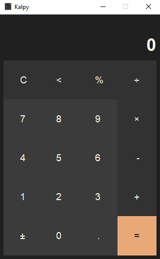

# Kalpy

Kalpy is a lightweight calculator that reimagines the Windows 10 basic mode with a sleek, modern Material Design interface.

## Logo

## UI

## For Windows Users: Pre-built Executable
If you prefer not to compile the project yourself, a pre-built Windows executable is available for direct use. You can find it in the **Releases** section of this repository.  

For those who wish to rebuild the executable, the PyInstaller build configuration is located in the [kalpy.spec](kalpy.spec) file.

## Requirements
*This desktop application was built using Python 3.10.*
* Only the Tkinter library is needed to run from source.

## Open Source
Kalpy is an open-source project. Feel free to fork the repository, explore the code, and contribute to its development!

## License
This project is licensed under the [MIT License](LICENSE) – see the [LICENSE file](LICENSE) for details.